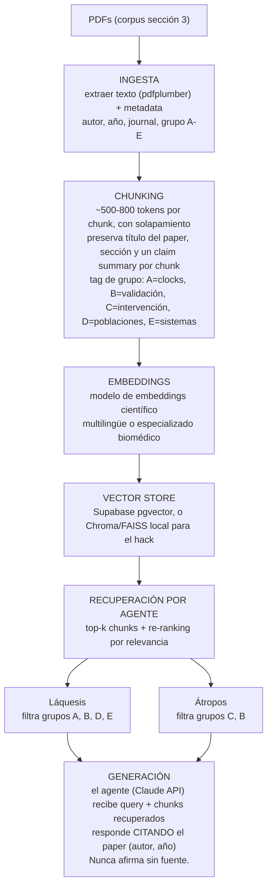

# MOIRAI - RAG Científico para los Tres Agentes
## Base de conocimiento nivel frontera (2004-2026) - para Claude Code

> **Cómo usar:** ábrelo con Claude Code y di: *"Lee MOIRAI_RAG_SPEC.md. Construye el pipeline RAG: ingesta de PDFs, chunking, embeddings, vector store, y la función de recuperación que cada agente (Cloto, Láquesis, Átropos) consulta según su rol. Usa el corpus de la sección 3."*

---

## 0. QUÉ HACE ESTE RAG Y POR QUÉ GANA
El RAG le da a los tres agentes una base científica real para que **no inventen**. Cuando Láquesis interpreta un biomarcador o Átropos recomienda una intervención, citan evidencia de papers reales indexados - no intuición del modelo. Eso es lo que sube el 25% de aspecto técnico y desactiva el escepticismo del jurado ("¿esto es humo?" -> "no, cada afirmación está anclada en literatura indexada").

**Regla de honestidad:** el RAG cita evidencia poblacional y de riesgo. NUNCA convierte eso en diagnóstico ni en profecía de enfermedad individual. Habla de asociación, riesgo y trayectoria probable, y deriva a profesionales.

---

## 1. HALLAZGOS FRONTERA QUE MOIRAI DEBE INCORPORAR (2024-2026)

Estos son los conceptos más recientes y top del mundo. Ubican a Moirai en la frontera:

1. **De "edad" a "velocidad de envejecimiento" (pace of aging).** Los clocks de nueva generación como DunedinPACE miden qué tan *rápido* envejeces ahora, no solo tu edad acumulada. Esto encaja perfecto con las trayectorias de Moirai.

2. **La edad biológica es FLUIDA y reversible.** Trabajo de Poganik et al. y otros: la edad biológica sube con estrés (cirugía, embarazo, enfermedad) y se restaura después. Prueba científica de la tesis de Moirai: puedes cambiar tu trayectoria.

3. **Clocks de 2ª y 3ª generación superan a los de 1ª.** Comparación a gran escala (n~18,859) de 14 clocks contra 174 enfermedades: los de nueva generación (PhenoAge, GrimAge, DunedinPACE) predicen enfermedad mucho mejor que Horvath/Hannum.

4. **Resiliencia, no solo daño (frontera 2026).** Frameworks emergentes distinguen la deriva degenerativa (daño) de la reparación adaptativa (resiliencia). Medir la *capacidad de recuperación* del sistema es lo más nuevo del campo.

5. **Clocks específicos de órgano.** "Tu longevidad la determina tu órgano más frágil" - clocks que detectan qué sistema se deteriora primero. Encaja con tu visión de sistemas.

6. **Intervenciones que sí mueven los clocks:** ejercicio, dieta rica en plantas, y agonistas GLP-1 como semaglutida han mostrado reducir la edad epigenética en estudios humanos. Base real para el motor de escenarios de Átropos.

---

## 2. CÓMO CADA AGENTE CONSULTA EL RAG

| Agente | Rol | Qué recupera del RAG |
|--------|-----|----------------------|
| **Cloto** (intake) | recolecta datos | Casi nada. Quizá rangos de referencia por edad/sexo. |
| **Láquesis** (análisis) | interpreta el sistema | Papers de clocks, biomarcadores, biología de sistemas, ancestría/disparidades. |
| **Átropos** (decisión) | recomienda | Papers de intervenciones, reversibilidad, efectos de hábitos sobre clocks. |

Cada agente recibe solo los chunks relevantes a su rol -> respuestas ancladas y precisas.

---

## 3. CORPUS DEL RAG (los papers a indexar)

> Descarga cada uno de fuentes legítimas (PubMed, PMC, el journal, tu acceso Uniandes). Prioriza open-access. Para el RAG, respeta licencias: usa texto que tengas derecho a usar. Los marcados [YA LO TIENES] son los que subiste o ya trabajaste.

### GRUPO A - Relojes de envejecimiento (núcleo de Láquesis)
- **Levine et al. (2018)** - "An epigenetic biomarker of aging for lifespan and healthspan" (PhenoAge). *Tu ancla.* Aging (Albany NY) 10, 573-591.
- **Horvath (2013)** - "DNA methylation age of human tissues and cell types". Genome Biol 14, R115. El fundacional.
- **Hannum et al. (2013)** - "Genome-wide methylation profiles reveal quantitative views of human aging rates". Mol Cell 49, 359-367.
- **Lu et al. (2019)** - "DNA methylation GrimAge strongly predicts lifespan and healthspan". Aging 11, 303-327.
- **Belsky et al. (2022)** - DunedinPACE (pace of aging). *Clave para trayectorias.*
- **Teschendorff & Horvath (2025)** - "Epigenetic ageing clocks: statistical methods and emerging computational challenges". Nat Rev Genet 26, 350-368. *Revisión reciente autorizada.*

### GRUPO B - Validación, comparación y frontera (para credibilidad)
- **Nature Communications (2025)** - "An unbiased comparison of 14 epigenetic clocks in relation to 174 incident disease outcomes" (n=18,859). Demuestra superioridad de clocks de nueva generación.
- **Moqri et al. (2024)** - "Validation of biomarkers of aging". Nat Med 30, 360-372. Estándar de validación.
- **Nature Aging (2026)** - "Longitudinal changes in epigenetic clocks predict survival (InCHIANTI)". Cambios temporales predicen mortalidad -> base de trayectorias.
- **EpiAge-R framework (2026)** - concepto de resiliencia (recuperación vs. daño). *Tu ángulo original.*
- **Horvath (2026)** - "Putting epigenetic aging clocks on trial". Nat Med. Escepticismo honesto - tenerlo te hace rigurosa, no ingenua.

### GRUPO C - Epigenética, ambiente y reversibilidad (núcleo de Átropos y de tu tesis)
- **Weaver et al. (2004)** - "Epigenetic programming by maternal behavior". Nat Neurosci 7, 847-854. [YA LO TIENES] *Prueba que ambiente -> epigenoma -> fenotipo, y es reversible.*
- **Poganik et al. (2023/2024)** - edad biológica fluida, sube con estrés y se restaura. *Tu tesis central validada.*
- **Frontiers (2026)** - "Interventions that decrease next-generation epigenetic aging clocks in humans" (41 estudios). Catálogo de qué intervenciones funcionan -> coeficientes para el motor.
- **Cavalli & Heard (2019)** - "Advances in epigenetics link genetics to the environment and disease". Nature. Revisión que conecta tu tesis.

### GRUPO D - Genética de poblaciones y disparidades (tu diferencial Global South)
- **Martin et al. (2019)** - "Clinical use of current polygenic risk scores may exacerbate health disparities". Nat Genet. *Tu misión hecha paper:* los scores europeos fallan en poblaciones diversas.
- **npj Aging (2026)** - "Genetic and molecular factors underlying human longevity and epigenetic aging" (GWAS: colesterol, células inmunes, IGF1 asociados a longevidad).

### GRUPO E - Biología de sistemas (tu referente Manolis Kellis)
- Revisiones de **Manolis Kellis (MIT/Broad)** sobre redes regulatorias y enfermedad como sistema multifactorial. Busca sus papers en Nature/Cell sobre epigenómica de enfermedad compleja.
- **Geroscience hypothesis** - la biología del envejecimiento como causa raíz de enfermedades crónicas (referenciado en InCHIANTI y otros).

---

## 4. ARQUITECTURA TÉCNICA DEL RAG



### Recomendación de stack para 36h
- **Vector store:** Supabase pgvector (ya está en tus sponsors) o Chroma local (más rápido de montar).
- **Embeddings:** un modelo de embeddings estándar; para biomédico, considera uno especializado si hay tiempo, si no, uno general funciona.
- **Orquestación:** una función `consultar_rag(query, grupos, k)` que cada agente llama.
- No sobre-ingenieres: 15-20 papers bien chunked > 200 mal indexados.

---

## 5. CONTRATO DE CITACIÓN (anti-alucinación)
Cada agente, al usar el RAG, DEBE:
1. Recuperar chunks antes de afirmar algo científico.
2. Citar la fuente en su respuesta: "(Levine et al., 2018)".
3. Si no hay evidencia recuperada para una afirmación, decir "no tengo evidencia indexada para esto" en vez de inventar.
4. Distinguir asociación de causalidad. Los clocks son mayormente correlacionales (dato honesto de la literatura 2025) - no prometer causación.

```python
# Pseudocódigo del contrato
def agente_responde(query, agente):
    grupos = GRUPOS_POR_AGENTE[agente]           # Láquesis→[A,B,D,E], Átropos→[C,B]
    chunks = consultar_rag(query, grupos, k=5)
    if not chunks:
        return "Sin evidencia indexada; requiere validación profesional."
    respuesta = claude_api(
        system=PROMPT_AGENTE[agente],
        context=chunks,                          # los papers recuperados
        query=query,
        regla="Cita autor/año. No afirmes sin fuente. Asociación ≠ causalidad."
    )
    return respuesta  # con citas
```

---

## 6. LO QUE NO SE HACE (protección)
- NO Convertir riesgo poblacional en diagnóstico o profecía de enfermedad individual.
- NO Indexar papers que no tengas derecho a usar (respeta licencias).
- NO Prometer causalidad donde la literatura dice correlación.
- NO 200 papers mal procesados. Mejor 15-20 del corpus, bien chunked.
- NO Que un agente afirme algo científico sin recuperar evidencia primero.

---

## 7. FRASES PARA EL JURADO (usan el RAG como prueba)
- "¿Sus agentes inventan?" -> "No. Cada afirmación científica se recupera de un corpus indexado de papers reales - Levine, Horvath, Belsky, comparaciones en Nature 2025. Si no hay evidencia, el agente lo dice."
- "¿Por qué es frontera?" -> "Incorporamos lo más reciente: pace of aging (DunedinPACE), reversibilidad de la edad biológica (Poganik), y el concepto de resiliencia de 2026. No es un clock viejo - es el estado del arte."
- "¿Y el sesgo poblacional?" -> "Lo abordamos de frente: Martin et al. 2019 muestra que los scores europeos fallan en poblaciones mixtas. Moirai se construye para corregir eso, para Latinoamérica."
